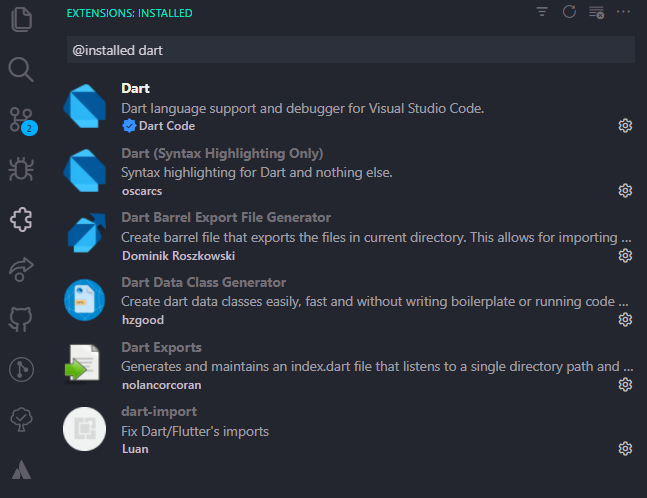
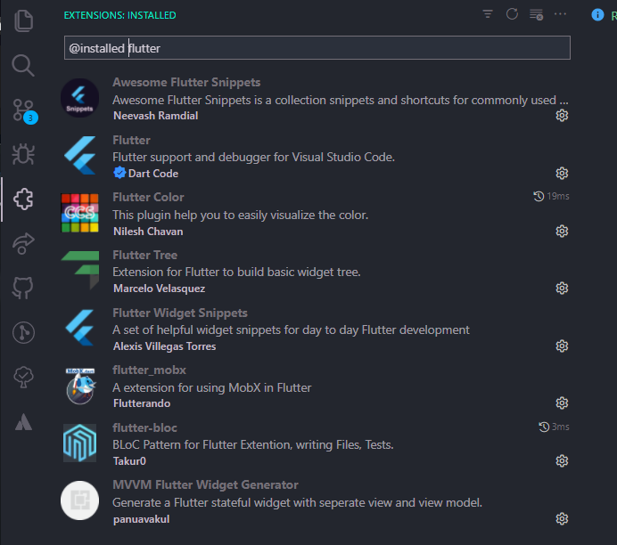

# Dart Programlama Dili Notları

## Başlarken
Bu repoda Flutter frameworkünün dili olan **Dart** programlama dilini öğrenmek için aldığım eğitimlerden derlediğim notları paylaşacağım. 

## VS Code İçin Dart ve Flutter Eklentileri

### Dart Eklentileri

### Flutter Eklentileri

## İçerikler

- [Bölüm 1](tutorials/bolum1/bolum1.md) -> Dart tarihçesi, temel bilgiler ve  kurulumlar
- [Bölüm 2](tutorials/bolum2/bolum2.md) -> Dart'a giriş, veri tipleri ve temel fonksiyonlar
- [Bölüm 3](tutorials/bolum3/bolum3.md) -> Koşullar (If - Else / Switch - Case)